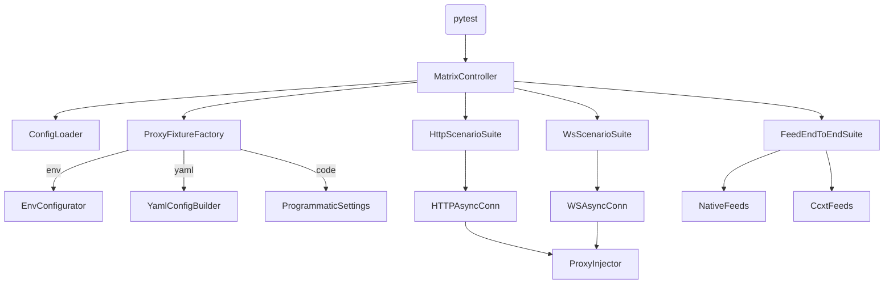

# Design Document

## Overview
Proxy integration testing expands cryptofeed's verification suite to prove that HTTP and WebSocket clients honor proxy configuration across both CCXT-backed and native exchange flows. The design delivers deterministic coverage for configuration precedence, transport-specific behavior, dependency fallbacks, and full feed execution under proxy settings.

## Goals
- Validate proxy precedence order (environment → YAML → programmatic) across all client types.
- Exercise HTTP and WebSocket transports with SOCKS and HTTP proxies, including credential handling.
- Run end-to-end feed scenarios for CCXT and native exchanges to ensure real callbacks traverse configured routes.
- Provide reusable fixtures and utilities so future tests can consume proxy scenarios with minimal boilerplate.

## Non-Goals
- Implement new proxy runtime features or modify production logic.
- Harden network-level reliability (e.g., retry policies, failover) beyond verifying existing behavior.
- Cover external proxy infrastructure performance or load testing.

## Architecture


## Component Design
### MatrixController
- Generates cartesian combinations of configuration precedence, exchange type (CCXT vs native), and transport (HTTP/WS).
- Provides parametrized markers (`@pytest.mark.proxy_matrix`) for selective execution.

### ConfigLoader
- Produces configuration payloads for each precedence level.
- Supplies helpers to assert effective settings exposed by `ProxySettings.get_proxy()`.

### ProxyFixtureFactory
- Applies environment variables, writes ephemeral YAML files, or constructs programmatic `ProxySettings` objects based on requested scenario.
- Ensures teardown removes env vars and resets `init_proxy_system()` to avoid cross-test bleed.

### HttpScenarioSuite
- Houses tests verifying `HTTPAsyncConn` behavior: session reuse, override vs default, credential redaction in logs.
- Leverages in-memory `DummySession` when isolation is required; uses actual aiohttp session for integration paths.

### WsScenarioSuite
- Validates `WSAsyncConn` with SOCKS (dependent on `python-socks`) and HTTP proxy configurations.
- Confirms missing `python-socks` raises documented error and that HTTP proxies attach required headers.

### FeedEndToEndSuite
- Spins up representative native feeds (e.g., Binance, Coinbase) and a CCXT feed (Backpack) against the proxy harness.
- Uses lightweight stubs or recorded fixtures to assert data callbacks occur while proxy logs/metrics register expected endpoints.
- Employs `FeedHandler` with injected proxy configuration to validate combined REST + WebSocket flows, including metadata prefetch and live stream callbacks.
- Provides adapter-specific assertions verifying `HTTPAsyncConn` and `WSAsyncConn` objects created inside feeds respect resolved proxies.

## Test Execution Flow
```mermaid
graph LR
    Start --> SetupEnv[Apply config precedence]
    SetupEnv --> InitProxy[init_proxy_system]
    InitProxy --> RunTransportTests
    RunTransportTests --> ValidateLogs
    ValidateLogs --> ResetProxy[init_proxy_system(disabled)]
    ResetProxy --> CleanupEnv[clear env + temp files]
    CleanupEnv --> End
```

## Data & Configuration Model
- Environment fixtures: applied via `monkeypatch.setenv` with teardown.
- YAML fixtures: temporary files under `.pytest_tmp` pointing to proxy blocks.
- Programmatic configuration: in-test `ProxySettings` definitions ensuring defaults and overrides.
- Exchange catalog: mapping of native vs CCXT exchanges used for end-to-end verification.

## Observability & Logging
- Capture `feedhandler` logger output to ensure proxy logs emit `scheme` and sanitized `endpoint` without credentials.
- Optionally emit structured metrics (e.g., Counter per exchange/proxy scheme) via fixture hooks for future dashboards.

## Error Handling Strategy
- Tests assert early failure when mandatory dependencies (python-socks) are missing.
- Each scenario ensures teardown resets injector, preventing global state contamination.
- YAML fixture assertions guard against malformed configuration, failing fast with descriptive messages.

## Risks & Mitigations
- **Risk:** Test flakiness due to external network availability. **Mitigation:** Use local loopback endpoints or stubs instead of real proxies.
- **Risk:** Credential leakage in logs. **Mitigation:** Dedicated logging tests and sanitization helper.
- **Risk:** CCXT dependency drift. **Mitigation:** Pin CCXT version in test environment and maintain recorded fixtures for deterministic behavior.

## Verification Strategy
- Unit: matrix controller, config loaders, logging sanitization helpers.
- Integration: HTTP/WS transport tests with live `HTTPAsyncConn` and `WSAsyncConn` objects.
- End-to-end: Feed execution verifying callbacks and proxy metrics/logs across CCXT and native exchanges, including assertion that event payloads originate from proxy-enabled sessions.
- CI: Add proxy test stage running unit + integration suites with and without python-socks installed.

## Deliverables
1. `tests/unit/test_proxy_matrix.py` – configuration precedence and utility coverage.
2. `tests/integration/test_proxy_http.py` & `test_proxy_ws.py` – REST/WebSocket transport scenarios.
3. `tests/e2e/test_proxy_feeds.py` – end-to-end CCXT/native feed verification.
4. Documentation and reporting:
   - Update `docs/proxy/user-guide.md` with execution instructions, pytest markers, and CI matrix notes.
   - Add `docs/proxy/testing.md` summarizing coverage by transport/exchange and how to interpret logs/metrics.
   - Ensure CLAUDE.md links to the proxy testing workflow once tasks complete.

## Open Questions
- Should metrics emission live inside tests or production code? (Current plan: test-only counters.)
- Which native exchanges offer deterministic fixtures suitable for CI? (Candidate: Binance REST mock.)

## Next Steps
- Approve requirements and this design.
- Generate tasks via `/kiro:spec-tasks proxy-integration-testing` outlining implementation sequence.
