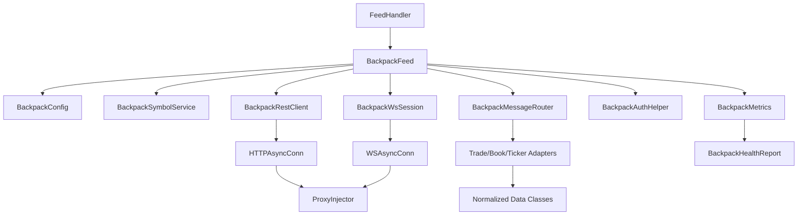
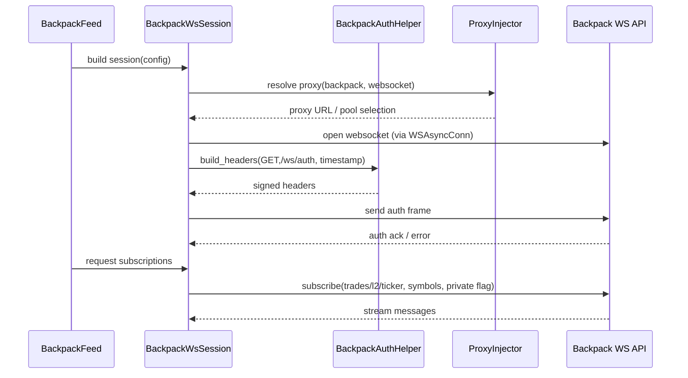
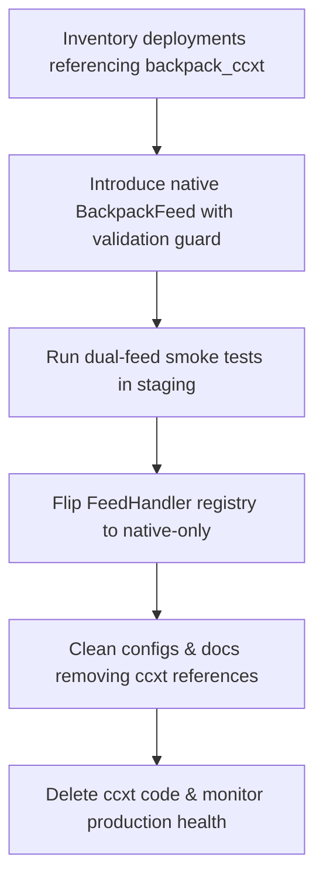

# Design Document

## Overview
The Backpack exchange integration delivers a native Cryptofeed feed that replaces the legacy ccxt pathway and aligns with the proxy-first architecture. The design introduces a cohesive set of configuration, transport, authentication, symbol, and routing components that satisfy Backpack’s ED25519 security model while preserving the standardized downstream interfaces already used by other exchanges. Native integration ensures deterministic configuration validation, proxy reuse, and uniform data normalization across public and private market data streams.

## Feature Classification & Scope
- **Feature Type:** Complex integration of an external exchange with custom authentication and transport semantics.
- **Process Adaptation:** Full technical design including architectural diagrams, component contracts, error strategy, migration, and risk analysis due to removal of prior ccxt scaffolding and introduction of ED25519 flows.

## Steering Alignment
- **Structure:** Respects SOLID by isolating configuration, transports, routers, metrics, and authentication helpers into focused modules (`cryptofeed/exchanges/backpack/*`).
- **Technology:** Reuses modern async transports, proxy system, and Decimal-based normalization, matching guidance from `CLAUDE.md` (KISS, DRY, NO LEGACY, NO COMPATIBILITY).
- **Product:** Meets requirements for first-class Backpack support without backwards compatibility toggles; any residual ccxt references produce actionable errors per specification.
- **Custom Steering:** No additional steering documents exist; this design is consistent with established exchange integrations (e.g., Coinbase, Kraken) while honoring project-wide proxy and observability standards.

## Assumptions & Constraints
- Backpack production endpoints remain `https://api.backpack.exchange` (REST) and `wss://ws.backpack.exchange` (WebSocket); sandbox endpoints append `/sandbox`.
- ED25519 signing requires 32-byte keys provided as hex or Base64; NaCl/pynacl is available for signing.
- The global proxy subsystem is already initialized via `init_proxy_system` before the feed is started.
- FeedHandler consumers expect normalized symbols, Decimal numeric types, float timestamps, and structured metrics consistent with existing exchanges.
- The codebase targets Python 3.12+; all new models must use Pydantic v2 and `slots=True` dataclasses where applicable.

## Requirements Traceability
| Requirement | Primary Components | Verification Strategy |
| --- | --- | --- |
| R1 Native Feed Activation & Legacy Removal | Feed registry updates, `BackpackFeed`, configuration loader validation | Unit tests rejecting `backpack_ccxt`, runtime smoke ensuring registry resolves native feed |
| R2 Configuration Validation & Simplicity | `BackpackConfig`, `BackpackAuthSettings`, config loader error handling | Pydantic validation tests, YAML config fixture tests, documentation walkthrough |
| R3 Transport & Proxy Integration | `BackpackRestClient`, `BackpackWsSession`, ProxyInjector usage | Proxy integration tests (HTTP+WS), pool rotation simulations |
| R4 Market Data Normalization | `BackpackSymbolService`, `BackpackMessageRouter`, adapters for trade/order book/ticker | Fixture-driven parser tests, integration tests covering snapshots + deltas |
| R5 ED25519 Authentication & Security | `BackpackAuthHelper`, `BackpackWsSession` auth handshake, REST signing hooks | Deterministic signing tests, auth failure simulations, timestamp window boundary tests |
| R6 Observability, Testing & Documentation | `BackpackMetrics`, health evaluation, docs/runbooks additions | Metrics snapshot assertions, health contract tests, doc build + lint checks |

## Architecture

### Component Diagram

### Data Flow Summary
1. FeedHandler instantiates `BackpackFeed`, which loads and validates `BackpackConfig` and ensures that any `backpack_ccxt` references raise configuration errors.
2. `BackpackFeed` initializes symbol metadata through `BackpackSymbolService`, caching normalized ↔ native symbol pairs and instrument metadata.
3. Public market data uses `BackpackRestClient` for initial snapshots (via `HTTPAsyncConn`) and `BackpackWsSession` for streaming updates (via `WSAsyncConn`); both resolve proxies through `ProxyInjector`.
4. Private channels leverage `BackpackAuthHelper` to sign requests; WebSocket auth frames are dispatched during `BackpackWsSession.open()` before subscriptions.
5. Incoming messages reach `BackpackMessageRouter`, which routes to channel-specific adapters producing normalized `Trade`, `OrderBook`, and `Ticker` objects delivered to registered callbacks with metrics instrumentation.
6. Metrics and health data are surfaced via `BackpackMetrics` counters and `BackpackHealthReport`, enabling feed-level health checks.

### Authentication & Subscription Sequence

## Component Specifications

### `BackpackFeed`
- **Purpose:** Exchange-specific `Feed` subclass orchestrating configuration, symbol metadata hydration, transport lifecycle, routing, and metrics.
- **Key Responsibilities:** Validate configuration, initialize symbol service, bind router callbacks, open transports via proxy-aware sessions, and expose health snapshots.
- **Interfaces:** Implements `connect()`, `subscribe()`, `message_handler()`, `shutdown()`, `metrics_snapshot()`, `health()`; uses `AsyncConnection` contracts.
- **Dependencies:** `BackpackConfig`, `BackpackSymbolService`, `BackpackRestClient`, `BackpackWsSession`, `BackpackMessageRouter`, `BackpackAuthHelper`, `BackpackMetrics`.
- **Extension Points:** Accepts dependency injection hooks for rest/ws factories (for testing), configurable `max_depth`, and custom symbol service for advanced workflows.

### `BackpackConfig`
- **Purpose:** Pydantic v2 model defining canonical configuration surface (exchange id, sandbox toggle, proxy overrides, auth credentials, window size).
- **Validation:** Enforces ED25519 key normalization, forbids legacy fields (e.g., `backpack_ccxt`, `rest_endpoint_override`), requires auth block when private channels enabled, clamps auth window to ≤ 10 000 ms.
- **Outputs:** Provides derived properties for REST/WS endpoints, `requires_auth`, and proxy override retrieval for transport factories.

### `BackpackAuthSettings` & `BackpackAuthHelper`
- **Purpose:** Normalize credentials and generate deterministic ED25519 signatures for REST and WebSocket flows.
- **Key Features:** Base64 normalization, NaCl signing key cache, timestamp generation in microseconds, window enforcement, optional passphrase inclusion.
- **Interfaces:** `build_headers(method, path, body, timestamp_us) -> dict[str, str]`, `sign_message(...) -> str`.
- **Resilience:** Raises `BackpackAuthError` with actionable messages when config is incomplete or signatures fail verification.

### `BackpackRestClient`
- **Purpose:** Execute REST calls for market discovery, snapshots, and private endpoints using `HTTPAsyncConn` with proxy resolution.
- **Responsibilities:** Construct `aiohttp` sessions with proxy URL from `ProxyInjector`, enforce retry/backoff policy aligned with global transport settings, and feed metric counters for retries/timeouts.
- **Interfaces:** `fetch_markets()`, `fetch_l2_snapshot(symbol)`, `fetch_private(endpoint, body)` etc., returning typed DTOs.

### `BackpackWsSession`
- **Purpose:** Manage WebSocket lifecycle, including proxy-aware connection establishment, authentication handshake, heartbeat, subscription management, and graceful shutdown.
- **Key Features:** Optional dependency injection for custom connection factory (used in tests), heartbeat task with failure escalation, metrics recording for messages/errors, pooled proxy rotation.
- **Interfaces:** `open()`, `subscribe(subscriptions)`, `read()`, `send(payload)`, `close()`.

### `BackpackSymbolService`
- **Purpose:** Lazily hydrate market metadata, maintain caches of normalized and native symbols, and surface instrument type metadata.
- **Data Source:** REST discovery endpoint (e.g., `/api/v1/markets`), using `BackpackRestClient` under retry guard.
- **Outputs:** `ensure()`, `native_symbol(normalized)`, `normalized_symbol(native)`, `all_markets()` returning immutable DTOs with `base`, `quote`, `type`, `tick_size`, `lot_size`, `status`.

### `BackpackMessageRouter` & Adapters
- **Purpose:** Deserialize channel-specific payloads and emit cryptofeed data classes (`Trade`, `OrderBook`, `Ticker`, private fills, balances) with correct precision and sequence semantics.
- **Routing Strategy:** Inspect `op` and `channel` fields, delegate to adapters with deterministic schema mapping, handle stateful order book reconciliation.
- **Error Handling:** Structured logging for malformed payloads, metrics increments, drop invalid events to satisfy requirement R4.3.

### `BackpackMetrics` & `BackpackHealthReport`
- **Purpose:** Aggregate counters (messages, reconnects, auth failures, parse errors) and evaluate feed health based on snapshot freshness and stream liveness.
- **Outputs:** `snapshot()` returning dict suitable for operator dashboards; `evaluate_health(metrics, max_snapshot_age)` returning typed report with status enums and remediation hints.

## Data Contracts
- **MarketMetadata:** `{symbol_id: str, normalized_symbol: str, base: str, quote: str, instrument_type: Literal['spot','perp'], tick_size: Decimal, lot_size: Decimal, status: Literal['online','offline']}`.
- **TradePayload:** `{channel: 'trades', symbol: str, price: Decimal, size: Decimal, side: Literal['buy','sell'], ts: float}` mapped to `Trade` objects with float timestamps and sequence ids where provided.
- **OrderBookSnapshot:** `{bids: list[PriceLevel], asks: list[PriceLevel], checksum: str, ts: float}`, where `PriceLevel = (Decimal price, Decimal size)`; router enforces depth limits and checksum validation when available.
- **OrderBookDelta:** `{updates: list[{side, price, size}], sequence: int}`; router applies via `BookUpdate` objects preserving ordering.
- **PrivateFill:** `{fill_id: str, order_id: str, price: Decimal, size: Decimal, fee: Decimal, liquidity: Literal['maker','taker'], ts: float}`, emitted to private callbacks when enabled.
- **AuthResponse:** `{op: 'auth', status: 'success'|'error', reason?: str}` guiding retry vs. fail-fast behavior.

## Proxy & Network Strategy
- `BackpackRestClient` creates HTTP sessions with `ProxyInjector.get_http_proxy_url('backpack')`; session creation fails fast with descriptive error when proxy pool misconfiguration occurs.
- `BackpackWsSession` requests WebSocket connections via `ProxyInjector.create_websocket_connection`, inheriting pool rotation and failure handling without exchange-specific logic.
- Proxy health events are surfaced through proxy metrics; Backpack metrics reference these signals to annotate reconnect reasons.
- Connection backoff follows global transport policy (exponential up to 30 s) while honoring proxy rotation on each retry.

## Error Handling & Resilience
- **Configuration Errors:** Missing or legacy fields raise `ValueError` with targeted migration message; surfaced during feed initialization.
- **Authentication Errors:** `BackpackAuthError` bubbles to FeedHandler with actionable context (invalid key length, stale timestamp). Retries allowed up to configurable threshold before halting private channels.
- **Transport Errors:** REST timeouts trigger retry/backoff and metrics increments; WebSocket read/write failures schedule reconnect with replay of pending subscriptions.
- **Data Quality Issues:** Malformed payloads produce structured warnings and are dropped; repeated failures for a channel trigger resubscription and health degradation flag.
- **Proxy Failures:** Proxy rotation occurs automatically; exhaustion raises critical alert instructing operators to refresh pool entries.

## Observability & Monitoring
- **Metrics:** `backpack.ws.messages`, `backpack.ws.reconnects`, `backpack.ws.auth_failures`, `backpack.rest.requests`, `backpack.rest.retries`, `backpack.parser.errors`, `backpack.proxy.rotation_count`.
- **Logs:** Include exchange id, channel, symbol, and correlation identifiers; redact `X-API-Key`, `X-Signature`, and passphrase data.
- **Health Checks:** `BackpackHealthReport` evaluates snapshot age, message cadence, auth status, and proxy availability; integrates with existing feedhandler health endpoint.
- **Alerts:** Trigger on sustained auth failures, >N consecutive proxy rotations, or stale snapshot beyond operator-defined SLA.

## Security Considerations
- ED25519 private keys stored as `SecretStr`; convert to bytes only during signing and immediately zero buffers when possible.
- Timestamp window limited to ≤10 000 ms; validation rejects wider ranges to mitigate replay attacks.
- Provide optional hook to inject external signer/HSM callable for environments that forbid raw key material in process memory.
- Enforce TLS verification for REST/WebSocket clients; expose configuration flag for certificate pinning if Backpack publishes fingerprints.
- Harden logging by avoiding payload dumps for private channels and ensuring error paths do not leak signatures.

## Performance & Scalability
- Aim for <50 ms end-to-end latency for auth signature generation; cache `SigningKey` instance per feed.
- Limit WebSocket subscriptions to requested channels and symbols; rely on router to handle fan-out efficiently.
- Backpressure strategy: bounded asyncio queues between WS session and router with drop-on-overload policy and metrics annotation.
- Support configurable order book depth (default 50 levels) and throttle REST snapshot refreshes to avoid hitting rate limits.

## Testing Strategy
- **Unit Tests:**
  - `test_backpack_config_validation` covering auth requirements, sandbox endpoints, proxy overrides, and legacy field rejection.
  - `test_backpack_auth_signatures` using deterministic fixtures to validate ED25519 signatures and timestamp windows.
  - `test_backpack_symbol_service` ensuring normalization mappings and cache refresh logic.
  - `test_backpack_router_public/private` verifying trade/order book/ticker/private payload normalization and error logging.
- **Integration Tests:**
  - Proxy integration harness verifying REST + WS traffic through HTTP, HTTPS, SOCKS proxies with pool rotation.
  - End-to-end feed simulation using recorded Backpack frames to validate router + callback flow without mocks.
  - REST snapshot plus delta synchronization ensuring order book convergence under reconnect scenarios.
- **Performance/Soak:** Stress WebSocket pipeline with bursty payloads to observe queue/backpressure behavior and metrics.
- **Security Tests:** Negative suites for malformed keys, expired timestamps, inconsistent window, and replay detection.
- **Documentation Checks:** Lint and build `docs/exchanges/backpack.md`; run example script against sandbox with mocked credentials to validate configuration instructions.

## Migration Strategy

- **Phase A:** Scan configuration repositories and CI pipelines to identify `backpack_ccxt` usage; produce remediation checklist.
- **Phase B:** Enable native feed in staging with strict validation rejecting ccxt identifiers; document new configuration defaults.
- **Phase C:** Execute integration and live sandbox tests covering public/private channels, proxy pools, and reconnection scenarios.
- **Phase D:** Update feed registry and release notes to declare native feed canonical; monitor metrics for regressions.
- **Phase E:** Remove legacy modules and update runbooks; maintain heightened monitoring for one release cycle.

## Risks & Mitigations
| Risk | Impact | Mitigation |
| --- | --- | --- |
| Backpack API schema drift (fields renamed/added) | Breaks adapters or symbol cache | Contract tests with recorded fixtures, explicit schema versioning, fast patch workflow |
| Proxy pool exhaustion | Degraded connectivity or stuck sessions | Metrics-backed alerts, automatic pool rotation, operator runbooks for refreshing pools |
| ED25519 misconfiguration | Auth failures preventing private data | Deterministic config validation, CLI key validator, actionable error messages |
| Sequence gaps in order books | Downstream consumers receive inconsistent books | Snapshot + delta reconciliation with checksum validation and resubscribe on gap detection |
| Sandbox/mainnet divergence | Tests miss production-only behavior | Maintain sandbox + mainnet recording fixtures, periodic live smoke tests with limited scope |

## Open Questions
- Does Backpack differentiate API key scopes that require dynamic feature detection during subscription?
- Are there rate-limit headers or retry-after semantics we should surface explicitly in metrics?
- Will Backpack introduce additional private topics (balances, positions) that require early abstraction design?

## Out of Scope
- Automated funding rate or perpetual-specific analytics (future enhancement once Backpack exposes data).
- Historical data backfill tooling; current scope focuses on live streaming and snapshot synchronization.
- Multi-region load balancing; rely on upstream proxy infrastructure for geographic redundancy.

## References
- Backpack Exchange REST & WebSocket API documentation (retrieved 2025-09-26).
- Backpack Exchange authentication guide detailing ED25519 signing requirements (retrieved 2025-09-26).
