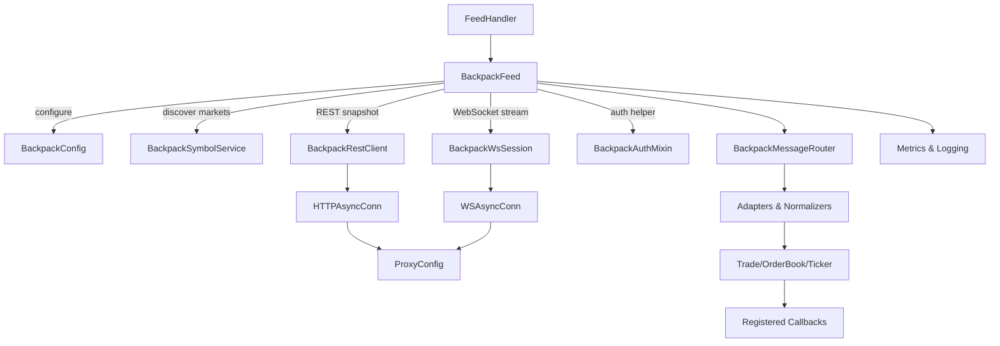
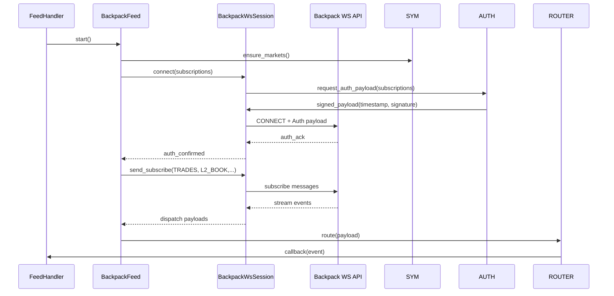

# Design Document

## Overview
Backpack exchange integration will deliver a native cryptofeed `Feed` implementation that mirrors mature exchanges (Binance, Coinbase) while satisfying Backpack-specific requirements such as ED25519 authentication, symbol normalization, and proxy-aware transports. The solution removes reliance on ccxt/ccxt.pro wrappers, enabling first-class alignment with cryptofeed engineering principles defined in `CLAUDE.md` (SOLID, KISS, DRY, NO LEGACY) and the approved requirements.

## Feature Classification
- **Type:** Complex integration of an external exchange with bespoke authentication
- **Scope Adaptation:** Full analysis (requirements mapping, architecture, security, migration) due to new domain APIs and divergence from existing ccxt scaffolding.

## Assumptions & Constraints
- Backpack HTTP base URL `https://api.backpack.exchange` and WebSocket endpoint `wss://ws.backpack.exchange` are stable for production usage.[^ref-backpack-api]
- Private REST/WebSocket operations require ED25519 signatures using microsecond timestamps and Base64-encoded signatures.[^ref-backpack-auth]
- Native cryptofeed transports (`HTTPAsyncConn`, `WSAsyncConn`) already integrate with the proxy system and must be reused.
- No steering documents were found under `.kiro/steering/`; guidance defaults to `CLAUDE.md` principles and existing exchange patterns.
- Implementation must coexist with current ccxt-based scaffolding during migration; eventual removal of redundant code is planned.

## Requirements Traceability
| Requirement | Implementation Surfaces | Verification |
| --- | --- | --- |
| R1 Exchange Configuration | `BackpackFeed.__init__`, `BackpackConfig` dataclass, validation in `config/backpack.py` | Unit tests covering config validation, integration smoke configuring exchange via YAML/JSON |
| R2 Transport Behavior | `BackpackRestClient` (wrapping `HTTPAsyncConn`), `BackpackWsSession` (wrapping `WSAsyncConn`), proxy injection hooks | Integration tests using proxy fixtures, transport unit tests asserting endpoint usage |
| R3 Data Normalization | `BackpackMessageRouter`, `BackpackTradeAdapter`, `BackpackOrderBookAdapter`, logging strategy | Parser unit tests with fixtures, FeedHandler integration assertions, log capture tests |
| R4 Symbol Management | `BackpackSymbolService` cache, symbol discovery REST call, mapping helpers | Symbol unit tests, snapshot fixture validation, CLI smoke verifying normalized/exchange symbol APIs |
| R5 ED25519 Authentication | `BackpackAuthMixin`, key validation module, signing utilities, private channel handshake | Crypto unit tests for signing, WebSocket auth sequence tests, negative-case tests for invalid keys |
| R6 Testing & Documentation | New unit/integration suites, `docs/exchanges/backpack.md`, developer runbooks | CI coverage thresholds, doc review checklist, manual QA runbook |

## Architecture Overview

### Component Diagram


### Data Flow Summary
1. `FeedHandler` instantiates `BackpackFeed` with config validated by `BackpackConfig`.
2. `BackpackFeed` loads market metadata through `BackpackSymbolService`, caching normalized and native identifiers.
3. Public flows: `BackpackRestClient` fetches snapshots over `HTTPAsyncConn`; `BackpackWsSession` streams deltas via `WSAsyncConn`.
4. Private flows: `BackpackAuthMixin` injects ED25519 headers and signing payloads before REST calls and WebSocket subscriptions.
5. `BackpackMessageRouter` dispatches channel-specific payloads to adapters that emit cryptofeed data classes and callbacks.

## Component Design

### `BackpackConfig`
- **Purpose:** Strongly typed configuration entry point; enforces Backpack-specific options (API key, secret seed, public key, sandbox toggle, optional proxy overrides).
- **Structure:** Pydantic model with fields `exchange_id: Literal["backpack"]`, `api_key: SecretStr`, `public_key: HexString`, `private_key: HexString`, `passphrase: str | None`, `use_sandbox: bool`, `proxies: ProxySettings`, `channels: list[Channel]`, `symbols: list[SymbolCode]`.
- **Validation Rules:**
  - ED25519 keys must be 32-byte seeds encoded as hex or Base64 (auto-detected and normalized).
  - When `enable_private_channels` is true, `api_key`, `public_key`, and `private_key` become mandatory.
  - Sandbox flag switches endpoints to `https://api.backpack.exchange/sandbox` and `wss://ws.backpack.exchange/sandbox`.
- **Outputs:** Provides `rest_endpoint`, `ws_endpoint`, `headers`, and `auth_window` configuration consumed by feed and transports.

### `BackpackSymbolService`
- **Purpose:** Market metadata loader with normalization logic.
- **Responsibilities:**
  - Fetch `/api/v1/markets` once per session, caching by environment.
  - Produce dataclass `BackpackMarket(symbol: SymbolCode, native_symbol: str, instrument_type: InstrumentType, precision: DecimalPrecision)`.
  - Expose `normalize(symbol: str) -> SymbolCode` and `native(symbol: SymbolCode) -> str` methods.
- **Implementation Notes:**
  - Uses `BackpackRestClient` in read-only mode for discovery.
  - Instrument typing derived from market payload fields (`type`, `perpetual`, etc.).
  - Cache invalidation triggered when feed refresh requested or after 15 minutes.

### `BackpackRestClient`
- **Purpose:** REST snapshot and auxiliary API wrapper leveraging `HTTPAsyncConn`.
- **Key Methods:**
  - `async fetch_order_book(symbol: SymbolCode, depth: int) -> BackpackOrderBookSnapshot`
  - `async fetch_symbols() -> list[BackpackMarket]`
  - `async sign_and_request(method: HttpMethod, path: str, body: Mapping[str, Any]) -> JsonPayload`
- **Behavior:**
  - Applies exponential backoff, HTTP 429 handling, and circuit breaking aligned with proxy system.
  - Injects ED25519 headers for private requests through `BackpackAuthMixin`.
  - Emits structured logs on error (status, request id, symbol).

### `BackpackWsSession`
- **Purpose:** WebSocket lifecycle management with proxy support and reconnection semantics.
- **Key Methods:**
  - `async connect(subscriptions: list[BackpackSubscription])`
  - `async receive() -> BackpackWsMessage`
  - `async send(payload: JsonPayload)`
  - `async close(reason: str | None = None)`
- **Features:**
  - Maintains heartbeat watchdog; triggers reconnect when heartbeat gap exceeds 15 seconds.
  - On reconnect, resends authentication payload signed via `BackpackAuthMixin` and replays subscriptions.
  - Supports multiplexed channels (TRADES, L2_BOOK, TICKER, private topics) with message tagging.

### `BackpackAuthMixin`
- **Purpose:** Centralize ED25519 signing for REST and WebSocket flows.
- **Interfaces:**
  - `build_auth_headers(method: str, path: str, body: str | None, timestamp: int) -> dict[str, str]`
  - `sign_message(message: bytes) -> str` returning Base64 signature.
  - `validate_keys() -> None` raising `BackpackAuthError` when formatting fails.
- **Algorithm:**
  - Timestamp in microseconds (UTC) concatenated with method, path, body JSON per Backpack spec.
  - Signature uses libsodium-backed ED25519 (via `nacl.signing.SigningKey`).
  - `X-Window` default 5000 ms; configurable through config.
- **Security Controls:**
  - Secrets stored as `SecretStr`; conversions to bytes occur only in-memory.
  - Error messages avoid echoing raw keys.

### `BackpackMessageRouter`
- **Purpose:** Route inbound WebSocket payloads to type-specific adapters.
- **Flow:**
  1. Parse envelope: topic, symbol, type, payload.
  2. Dispatch to adapter map `{"trades": BackpackTradeAdapter, "orderbook": BackpackOrderBookAdapter, ...}`.
  3. Each adapter converts to canonical dataclasses (`Trade`, `OrderBook`, `Ticker`, `PrivateOrderUpdate`).
  4. Router handles error payloads by logging and raising retryable exceptions.
- **Extensibility:** Additional adapters can be registered for new Backpack topics.

### Adapters & Normalizers
- **BackpackTradeAdapter:** Converts trade price/size to `Decimal`, attaches microsecond timestamp, maps `side` to `BUY`/`SELL` enums, sets sequence from `s` field.
- **BackpackOrderBookAdapter:** Maintains order book state per symbol with snapshot+delta strategy, ensuring sorted bids/asks and gap detection using `sequence`.
- **BackpackTickerAdapter:** Emits `Ticker` objects with OHLC values and 24h stats.
- **Error Logging:** On malformed payloads, adapters raise `BackpackPayloadError`, captured by router.

### Observability & Instrumentation
- Use structured logs tagged with `exchange=BACKPACK`, `channel`, `symbol`.
- Emit metrics via existing feed metrics hooks: connection retries, auth failures, message throughput, parser errors.
- Optional histogram instrumentation for signature latency and payload parsing time.

## Data Models
- `BackpackOrderBookSnapshot`: immutable dataclass with `symbol: SymbolCode`, `bids: list[PriceLevel]`, `asks: list[PriceLevel]`, `timestamp: float`, `sequence: int`.
- `PriceLevel`: tuple-like class `(price: Decimal, size: Decimal)` with ordering defined.
- `BackpackTradeMessage`: dataclass containing `trade_id: str`, `price: Decimal`, `size: Decimal`, `side: Side`, `sequence: int | None`, `timestamp: float`.
- `BackpackSubscription`: dataclass referencing channel enum, symbol, and auth scope (public/private).
- All types expose precise fields without `Any`; JSON payloads parsed into typed structures using Pydantic models or `msgspec` to guarantee validation.

## Key Flows

### WebSocket Authentication Sequence


### Order Book Snapshot + Delta Flow
1. `BackpackFeed.bootstrap_l2` invokes `BackpackRestClient.fetch_order_book` for initial snapshot.
2. Snapshot stored in `BackpackOrderBookAdapter` state with sequence baseline.
3. WebSocket update with `sequence` arrives; adapter verifies monotonicity, applies deltas, emits `OrderBook` update.
4. Gap detection triggers resync when `sequence` jump detected or 30s stale, reissuing REST snapshot.

## Error Handling Strategy
- **Configuration Errors:** Raise `BackpackConfigError` with actionable messages; fail fast during feed initialization.
- **Authentication Errors:** Wrap underlying ED25519 issues in `BackpackAuthError`; after three consecutive failures, circuit breaker opens for 60 seconds.
- **Transport Errors:** Use retry with jitter (REST) and controlled exponential backoff (WS). Proxy failures escalate with context (proxy URL, exchange).
- **Payload Errors:** Log offending payload, drop event, increment error metric; repeat offenders trigger automatic resubscribe.
- **Business Logic Errors:** Invalid symbol or unsupported channel returns descriptive error and prevents subscription.

## Security Considerations
- Store ED25519 secrets using `SecretStr`; zeroize byte arrays immediately after signing when using `pynacl`.
- Clamp `X-Window` (max 10000 ms) to avoid replay vulnerability.
- Enforce TLS certificate validation through default `aiohttp`/`websockets` clients.
- Provide optional HSM integration by abstracting signing method (callable injection) for infrastructure readiness.
- Log redaction for sensitive headers (`X-API-Key`, `X-Signature`).

## Performance & Scalability
- Target <50 ms signing overhead; cache signing key objects to avoid repeated instantiation.
- Limit order book depth to configurable `max_depth` (default 50 levels) to reduce downstream load.
- Employ bounded queues between `BackpackWsSession` and router to avoid memory blow-up; backpressure triggers resubscribe with lower depth.
- Monitor throughput metrics to auto-tune reconnection thresholds under high message volumes.

## Observability & Monitoring
- Metrics: `backpack.ws.reconnects`, `backpack.rest.retry_count`, `backpack.auth.failures`, `backpack.parser.errors`.
- Logging: include correlation ids from Backpack responses when available.
- Health Checks: expose feed status via existing health subsystem, reporting snapshot age and subscription freshness.

## Testing Strategy
- **Unit Tests:**
  - `test_backpack_config_validation` for credential requirements and sandbox endpoints.
  - `test_backpack_auth_signatures` verifying Base64 signatures against known vectors.
  - `test_backpack_symbol_service` covering normalization, cache invalidation, instrument typing.
  - `test_backpack_adapters` using JSON fixtures for trades, order books, tickers, private updates.
- **Integration Tests:**
  - WebSocket proxy integration using simulated proxy server and recorded Backpack frames.
  - Parallel public + private subscription flow verifying callbacks and reconnection.
  - REST-WS bootstrap synchronization ensuring snapshot + delta coherence.
- **Performance/Load:**
  - Stress test WebSocket adapter with bursty updates to validate queue/backpressure logic.
- **Security Tests:**
  - Negative tests for invalid ED25519 keys, expired timestamps, replayed signatures.
- **Documentation Validation:**
  - Lint docs, run example script against sandbox using mocked credentials.

## Migration Strategy
```mermaid
flowchart TD
    A[Audit current ccxt-based Backpack usage] --> B[Introduce native BackpackFeed behind feature flag]
    B --> C[Run parallel smoke tests (public + private)]
    C --> D[Flip FeedHandler defaults to native implementation]
    D --> E[Deprecate and remove ccxt Backpack scaffolding]
    E --> F[Post-migration review & docs update]
```
- **Phase A:** Inventory current ccxt usage in tests and production configs; document dependencies.
- **Phase B:** Ship native feed alongside ccxt version, guarded by configuration toggle.
- **Phase C:** Execute integration suite and limited live trial using sandbox/mainnet with monitoring.
- **Phase D:** Update feed registry and user-facing docs to point to native feed.
- **Phase E:** Delete ccxt scaffolding and adjust tests to remove legacy paths.

## Risks & Mitigations
- **Risk:** Backpack API schema evolution (fields renamed). **Mitigation:** Version market schema parsing, add contract tests with recorded fixtures.
- **Risk:** ED25519 key misuse causing auth outages. **Mitigation:** Provide CLI validator script and improved error surfacing.
- **Risk:** Proxy compatibility issues. **Mitigation:** Maintain parity tests with proxy pool system, allow override of proxy settings per environment.
- **Risk:** Parallel ccxt + native implementations diverge. **Mitigation:** Keep shared fixtures, centralize topic constants, enforce code freeze on ccxt path once migration begins.

## Documentation Deliverables
- Update `docs/exchanges/backpack.md` with setup, auth, troubleshooting, and proxy guidance.
- Add `examples/backpack_native.py` demonstrating both public and private channel usage.
- Extend operator runbooks with alerting thresholds and recovery steps.

## Open Questions
- Are Backpack private channel permissions differentiated by API key scopes requiring dynamic subscription negotiation?
- Does Backpack expose additional rate-limit headers we should surface in metrics?
- Should we expose a config option to fall back to ccxt temporarily for unsupported topics?

## Approval Checklist
- Requirements traceability confirmed for R1–R6.
- Architecture diagrams reviewed.
- Security and migration strategies defined.
- Test coverage obligations enumerated for unit, integration, and performance.

## References
- [^ref-backpack-api]: Backpack Exchange REST & WebSocket API documentation, section "API Basics" (accessed 2025-09-26).
- [^ref-backpack-auth]: Backpack Exchange authentication documentation, detailing ED25519 signature requirements (accessed 2025-09-26).
