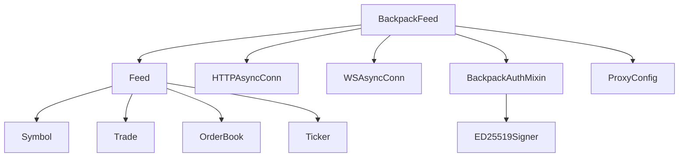

# Design Document

## Overview
Backpack exchange integration follows native cryptofeed patterns, implementing a complete Feed subclass similar to existing exchanges like Binance and Coinbase. The design leverages existing cryptofeed infrastructure including proxy support, connection handling, and data normalization while adding Backpack-specific functionality for ED25519 authentication and API endpoints.

## Goals
- Provide native Backpack Feed implementation that follows established cryptofeed patterns.
- Implement ED25519 authentication for private channel access.
- Ensure Backpack data flows through standard cryptofeed data types (Trade, OrderBook, etc.).
- Deliver automated tests (unit + integration) validating Backpack behavior with proxy-aware transports.
- Leverage existing proxy infrastructure for HTTP and WebSocket connections.

## Non-Goals
- Create new authentication frameworks (use existing cryptofeed config patterns).
- Implement advanced private-channel handling beyond basic order/position updates.
- Modify core cryptofeed infrastructure (work within existing Feed patterns).

## Architecture

## Component Design

### BackpackFeed (Main Exchange Class)
- Inherits from `Feed` base class following established cryptofeed patterns
- Defines exchange-specific constants:
  - `id = BACKPACK`
  - `websocket_endpoints = [WebsocketEndpoint('wss://ws.backpack.exchange')]`
  - `rest_endpoints = [RestEndpoint('https://api.backpack.exchange')]`
  - `websocket_channels` mapping cryptofeed channels to Backpack stream names
- Implements required methods: `_parse_symbol_data`, message handlers, subscription logic

### BackpackAuthMixin (Authentication Helper)
- Handles ED25519 signature generation for private channels
- Provides methods for creating authenticated requests with proper headers:
  - `X-Timestamp`, `X-Window`, `X-API-Key`, `X-Signature`
- Validates ED25519 key format and provides error messages
- Manages signature base string construction per Backpack specification

### Symbol Management
- Implements `_parse_symbol_data` to convert Backpack market data to cryptofeed Symbol objects
- Handles instrument type detection (SPOT, FUTURES) based on Backpack market metadata
- Provides symbol mapping between cryptofeed normalized names and Backpack native formats

### Message Handlers
- `_trade_update`: Parse Backpack trade messages to cryptofeed Trade objects
- `_book_update`: Handle L2 order book depth updates to OrderBook objects
- `_ticker_update`: Convert Backpack ticker data to Ticker objects
- Handle microsecond timestamp conversion to cryptofeed float seconds

### Connection Management
- Uses standard `HTTPAsyncConn` for REST API requests with proxy support
- Uses standard `WSAsyncConn` for WebSocket connections with proxy support
- Implements subscription/unsubscription message formatting per Backpack API
- Handles connection lifecycle and authentication for private streams

### Error Handling & Logging
- Standard cryptofeed logging with Backpack-specific context (exchange ID `BACKPACK`)
- ED25519 authentication error handling with descriptive messages
- API rate limiting and error code handling per Backpack documentation

## Testing Strategy

### Unit Tests
- **ED25519 Authentication**: Test signature generation, key validation, header formatting
- **Symbol Management**: Test symbol parsing, normalization, and mapping
- **Message Parsing**: Test trade, orderbook, and ticker message conversion to cryptofeed objects
- **Configuration**: Test Feed initialization, endpoint configuration, and error handling
- **Timestamp Handling**: Test microsecond to float seconds conversion

### Integration Tests
- **Proxy Support**: Confirm HTTP and WebSocket connections work through proxy configuration
- **Public Streams**: Test live market data streams (trades, depth, ticker) with recorded fixtures
- **Private Streams**: Test authenticated streams with sandbox credentials if available
- **Connection Lifecycle**: Test connection, reconnection, and error recovery scenarios
- **Data Validation**: Confirm all emitted data matches cryptofeed type specifications

### Smoke Tests
- **FeedHandler Integration**: Run Backpack feed via `FeedHandler` with proxy settings
- **Multi-Symbol Subscriptions**: Test concurrent symbol subscriptions and data flow
- **Performance**: Basic latency and throughput validation

## Documentation

### Exchange Documentation (`docs/exchanges/backpack.md`)
- Configuration setup and ED25519 key generation instructions
- Supported channels and symbol formats
- Private channel authentication setup
- Proxy configuration examples
- Rate limiting and API usage guidelines

### API Reference
- BackpackFeed class documentation
- BackpackAuthMixin usage examples
- Configuration parameter reference

## Risks & Mitigations

### Technical Risks
- **ED25519 Library Dependencies**: Mitigate with clear dependency documentation and fallback options
- **API Changes**: Handle via versioned endpoints and comprehensive integration tests
- **Authentication Complexity**: Provide clear examples and error messages for key format issues
- **Microsecond Timestamps**: Ensure precision preservation in conversion to float seconds

### Operational Risks
- **Rate Limiting**: Implement proper request throttling and backoff strategies
- **Connection Stability**: Use existing cryptofeed reconnection patterns
- **Proxy Compatibility**: Leverage existing proxy testing infrastructure

## Deliverables

### Core Implementation
1. `cryptofeed/exchanges/backpack.py` - Main Backpack Feed class
2. `cryptofeed/exchanges/mixins/backpack_auth.py` - ED25519 authentication mixin
3. `cryptofeed/defines.py` - Add BACKPACK constant

### Testing Suite
4. `tests/unit/test_backpack.py` - Comprehensive unit test coverage
5. `tests/integration/test_backpack_proxy.py` - Proxy integration testing
6. `tests/fixtures/backpack/` - Sample message fixtures for testing

### Documentation
7. `docs/exchanges/backpack.md` - Exchange-specific documentation
8. `examples/backpack_demo.py` - Usage example script
9. Update `README.md` and exchange listing documentation

### Configuration
10. Update exchange discovery and registration in `cryptofeed/exchanges/__init__.py`
