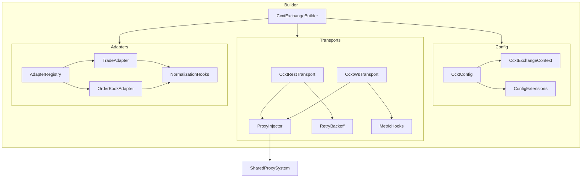

# Design Document

## Overview
Refactor the CCXT/CCXT-Pro integration layer so it resides under a cohesive
`cryptofeed/exchanges/ccxt/` package, applies FR-over-NFR prioritization, and
reuses the shared proxy system delivered in `proxy-system-complete`. The
refactor keeps derived exchanges thin while formalizing extension hooks,
conventional commit hygiene, and a stepwise hardening plan.

## Goals
- Deliver functional parity first: standardized configuration, transports, and
  data adapters that work for current CCXT exchanges.
- Integrate HTTP/WebSocket proxy handling without bespoke per-exchange logic.
- Expose declarative hooks (symbols, timestamps, prices, auth) for derived
  exchanges.
- Stage non-functional improvements (metrics depth, performance tuning) after
  the FR baseline ships.

## Engineering Principles Applied
- **FRs over NFRs:** functional behavior comes first; advanced telemetry follows.
- **KISS & SOLID:** small focused modules and explicit extension interfaces.
- **Conventional Commits:** change descriptions should use scoped prefixes such
  as `feat(ccxt):` or `refactor(ccxt):`.
- **Proxy-first:** transports always consult the proxy injector.
- **NO LEGACY:** retire compatibility shims promptly once canonical imports are adopted.

## Non-Goals
- Address exchange-specific quirks beyond what hooks allow.
- Replace native (non-CCXT) integrations.
- Introduce external proxy pool services (deferred until roadmap alignment).

## Architecture


## Package Layout
```
cryptofeed/exchanges/ccxt/
  ├── __init__.py          # public exports & legacy shims
  ├── config.py            # Pydantic models + extensions
  ├── context.py           # runtime view (CcxtExchangeContext)
  ├── extensions.py        # hook registration utilities
  ├── transport/
  │    ├── rest.py         # proxy-aware REST transport
  │    └── ws.py           # proxy-aware WebSocket transport
  ├── adapters/
  │    ├── trade.py
  │    ├── orderbook.py
  │    └── registry.py
  ├── builder.py           # exchange creation factory
  └── feed.py              # thin feed wrapper
```
Legacy compatibility modules have been removed; `cryptofeed/exchanges/ccxt/` is
now the single canonical import surface for CCXT integrations.

## Component Design

### Configuration Layer
- `CcxtConfig`: Pydantic v2 model (frozen, extra='forbid') capturing API keys,
  proxies, timeouts, sandbox flag.
- `CcxtConfigExtensions`: decorator helpers to register additional typed fields
  for specific exchanges.
- `CcxtExchangeContext`: computed runtime view (base URLs, resolved proxy URLs,
  throttling knobs) without performing I/O.

### Transport Layer
- `CcxtRestTransport`
  - Reads proxy information via `ProxyInjector.get_http_proxy_url`.
  - Wraps `aiohttp.ClientSession` with retry/backoff and structured logging.
  - Exposes request/response hooks for signing or payload transformations.
- `CcxtWsTransport`
  - Uses `ProxyInjector.create_websocket_connection` for HTTP/SOCKS proxies.
  - Supports auth callbacks, reconnection, and basic metrics counters.
  - Falls back gracefully when WebSocket support is unavailable (REST-only).

### Adapter & Registry Layer
- `BaseTradeAdapter` / `BaseOrderBookAdapter` define abstract `convert_*`
  methods plus hook calls for symbol, timestamp, and price normalization.
- `AdapterRegistry` maintains active adapters, fallback behavior, and hook
  registration for derived exchanges.
- Hook API: decorators `@ccxt_trade_hook('exchange_id')` etc. register custom
  conversions without editing core modules.

### Builder & Feed Integration
- `CcxtExchangeBuilder` orchestrates validation, transport instantiation,
  adapter registry wiring, and returns a ready-to-use `CcxtGenericFeed`.
- Builder enforces FR-first sequencing: configuration must validate before
  transports or adapters initialize.

## Functional Iteration Plan
1. **Baseline Functional Delivery**
   - Port package layout and re-export shims.
   - Implement config/context/extension modules.
   - Implement REST/WS transports with proxy integration.
   - Implement adapters + registry with default hooks.
   - Build exchange builder & thin feed wrapper.
2. **Post-Baseline Enhancements** (tracked separately)
   - Expand metrics (latency, throughput).
   - Performance profiling & tuning.
3. **Shim Retirement (Phase 7)**
   - Audit remaining references to legacy modules.
   - Remove compatibility shims once downstream consumers migrate.
   - Document removal, canonical imports, and update changelog.

## Testing Strategy
- **Unit**: config validation, proxy injection, adapter conversion, registry
  hook behavior.
- **Integration**: fixture-based REST + WebSocket flows covering proxy routing
  and private channel auth using patched CCXT clients.
- **Smoke**: FeedHandler run against recorded CCXT fixtures or sandbox when
  credentials available. These can ship after baseline if access is limited.

## Documentation
- Update `docs/exchanges/ccxt_generic.md` with refactored structure, FR-first
  rollout plan, and conventional commit examples.
- Update `docs/exchanges/ccxt_generic_api.md` to describe new modules and hook
  APIs.
- Publish migration note in `CHANGES.md` with spec reference.

## Risks & Mitigations
- **Breaking imports**: maintain re-export shims and document migration.
- **CCXT version drift**: pin versions and run regression fixtures in CI.
- **Proxy misconfiguration**: rely on shared injector validation; add targeted
  integration tests.

## Deliverables
1. Refactored `cryptofeed/exchanges/ccxt/` package with legacy shims.
2. Updated transports, adapters, registry, builder, and feed modules.
3. Unit/integration smoke tests validating FR behavior plus `@pytest.mark.ccxt_future`
   placeholders for deferred sandbox/performance work.
4. Documentation & release notes describing the refactor, canonical imports, and
   shim retirement timeline.

Commit guidance: use conventional commit prefixes (e.g., `feat(ccxt):`,
`refactor(ccxt):`) tied to tasks in this spec.
