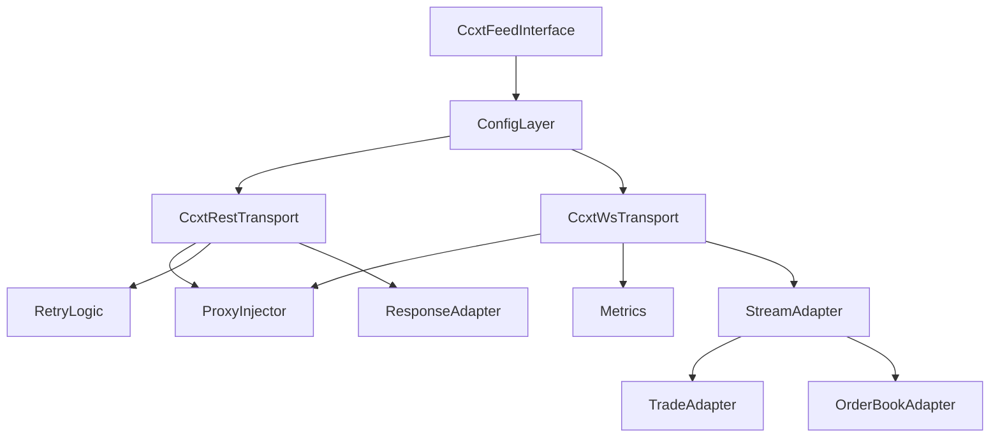

# Design Document

## Overview
The CCXT/CCXT-Pro generic exchange abstraction provides a reusable integration layer for all CCXT-backed exchanges within cryptofeed. It standardizes configuration, transport wiring, and data normalization so that individual exchange modules become thin adapters. The abstraction exposes clear extension points for exchange-specific behavior while ensuring shared concerns (proxy support, logging, retries) are handled centrally.

## Goals
- Centralize CCXT configuration via typed Pydantic models.
- Wrap CCXT REST and WebSocket interactions in reusable transports supporting proxy/logging policies.
- Provide adapters that convert CCXT payloads into cryptofeed’s normalized Trade/OrderBook objects.
- Offer extension hooks so derived exchanges can override symbols, endpoints, or auth without duplicating boilerplate.

## Non-Goals
- Implement exchange-specific quirks (handled in derived specs e.g., Backpack).
- Replace non-CCXT exchanges or alter existing native integrations.
- Provide sophisticated stateful caching beyond CCXT’s capabilities (out of scope for MVP).

## Architecture

## Component Design
- **Directory Layout**: All CCXT modules SHALL reside under `cryptofeed/exchanges/ccxt/` with submodules for config, transports, adapters, feed, and builder. Existing top-level imports MUST re-export from this package to avoid breaking public APIs during the relocation.
### ConfigLayer
- `CcxtConfig` Pydantic model capturing global settings (API keys, rate limits, proxies, timeouts).
- `CcxtExchangeContext` exposes resolved URLs, sandbox flags, and exchange options.
- Extension hooks: `CcxtConfigExtensions` allows derived exchanges to register additional fields without modifying the base model.

### Transport Layer
- `CcxtRestTransport`
  - Wraps CCXT REST calls, applying proxy retrieved from `ProxyInjector`, exponential backoff, and structured logging.
  - Provides request/response hooks so derived exchanges can inspect payloads.
- `CcxtWsTransport`
  - Orchestrates CCXT-Pro WebSocket sessions, binding authentication callbacks and integrating proxy usage.
  - Emits metrics (connection counts, reconnects, message rate) via shared telemetry helpers.
  - Falls back gracefully when WebSocket not supported.

### Data Adapters
- `CcxtTradeAdapter` converts CCXT trade dicts into cryptofeed `Trade` objects, preserving timestamps and IDs.
- `CcxtOrderBookAdapter` handles order book snapshots/updates, ensuring Decimal precision and sequence numbers.
- Adapter registry allows derived exchanges to override conversion steps when CCXT formats deviate.

### Extension Hooks
- `CcxtExchangeBuilder` factory that accepts exchange ID, optional overrides (endpoints, symbols), and returns a ready-to-use cryptofeed feed class.
- Hook points for:
  - Symbol normalization (custom mapping functions).
  - Subscription composition (channel-specific filters).
  - Authentication injectors (for private channels).

## Testing Strategy
- Unit Tests:
  - Config validation (required fields, inheritance, error messaging).
  - Transport proxy integration (ensuring proxy URLs passed to aiohttp/websockets).
  - Adapter correctness (trade/book conversion).
- Integration Tests:
  - Patch CCXT async/pro clients to simulate REST + WebSocket lifecycles (including private-channel auth) without external dependencies.
  - Validate proxy routing, authentication callbacks, and callback normalization using the shared transports.
- End-to-End Smoke Tests:
  - Run `FeedHandler` against the generic CCXT feed in a controlled environment (fixtures or sandbox) to exercise config → start → data callbacks, covering proxy + auth scenarios end-to-end.

## Documentation
- Developer guide detailing how to onboard a new CCXT exchange using the abstraction.
- API reference for configuration models and extension hooks.
- Testing guide describing pytest markers and how to run CCXT-specific suites with/without `python-socks`.

## Risks & Mitigations
- **CCXT API changes**: mitigate with version pinning and adapter test coverage.
- **Proxy configuration differences**: generic layer ensures consistent proxy application; logging tests catch regressions.
- **Performance overhead**: transports reuse sessions and avoid redundant conversions.

## Deliverables
1. `cryptofeed/exchanges/ccxt/` package containing:
   - `config.py`, `context.py`, `extensions.py` (configuration layer).
   - `transport/rest.py`, `transport/ws.py` (shared transports).
   - `adapters/__init__.py` for trade/order book conversion utilities.
   - `feed.py` and `builder.py` for generic feed orchestration.
   - Compatibility shims (e.g., `cryptofeed/exchanges/ccxt_config.py`) re-exporting new package symbols during migration.
2. Test suites: unit (`tests/unit/test_ccxt_config.py`, `tests/unit/test_ccxt_adapters_conversion.py`, `tests/unit/test_ccxt_generic_feed.py`), integration (`tests/integration/test_ccxt_generic.py`), smoke (`tests/integration/test_ccxt_feed_smoke.py`).
3. Documentation updates in `docs/exchanges/ccxt_generic.md` and `docs/exchanges/ccxt_generic_api.md` covering structure, configuration, and extension points.
