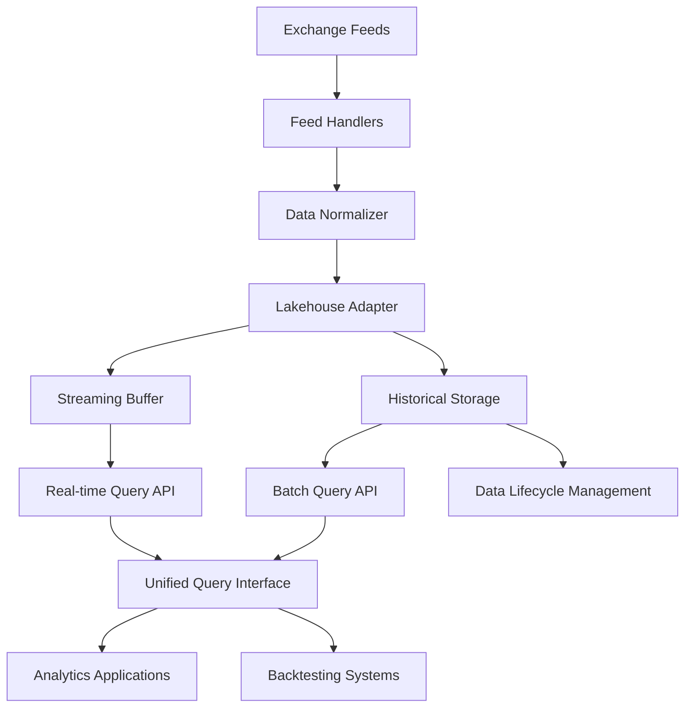
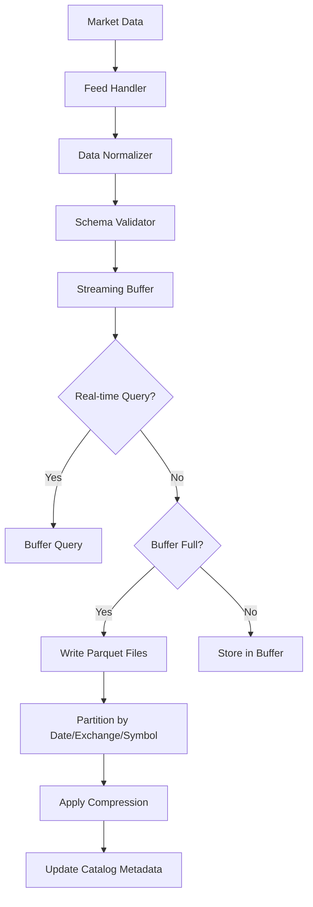
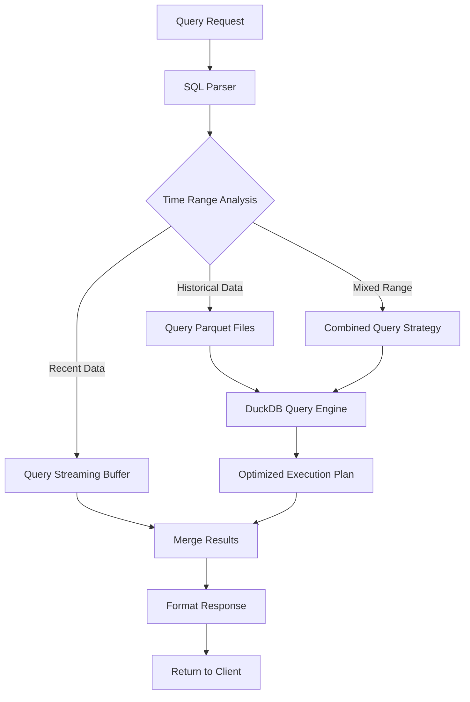

# Technical Design Document

## Overview

**Purpose**: This feature delivers a unified data lakehouse architecture that enables efficient storage, query, and analytics capabilities for high-frequency cryptocurrency market data to quantitative trading teams and data analysts.

**Users**: Quantitative researchers, algorithmic traders, and data engineers will utilize this for backtesting, real-time analytics, and historical data analysis workflows.

**Impact**: Transforms the current multi-backend storage approach by providing a unified data access layer that combines the benefits of data warehouses and data lakes for optimal analytical performance.

### Goals
- Provide unified access to both real-time streaming and historical market data
- Enable sub-second query performance for recent data and efficient batch processing for historical analysis
- Integrate seamlessly with existing cryptofeed exchange connectors and proxy infrastructure
- Support quantitative trading workflows including backtesting and real-time analytics
- Reduce operational complexity from managing multiple backend storage systems

### Non-Goals
- Replace all existing backend integrations (maintain compatibility)
- Provide real-time trading execution capabilities (analytics only)
- Support non-financial data types in initial implementation
- Complex data mesh or multi-tenant architecture (single-tenant focus)

## Architecture

### Existing Architecture Analysis

**Current Cryptofeed Patterns**:
- Backend adapter pattern with 15+ implementations (PostgreSQL, InfluxDB, MongoDB, Redis, Kafka, etc.)
- Unified data structures across all exchanges through feed handlers
- Async connection management with transparent proxy support
- Configuration-driven deployment with environment variables and YAML

**Integration Constraints**:
- Must maintain existing feed handler interfaces and data normalization
- Preserve current configuration patterns and proxy system integration
- Respect existing async processing architecture and connection pooling
- Maintain backward compatibility with current backend adapters

### High-Level Architecture



### Technology Alignment

**Leverages Existing Stack**:
- Python async architecture maintained for all components
- Pydantic v2 for configuration validation and settings management
- Existing proxy system for all external connections
- Current logging and monitoring patterns preserved

**New Dependencies Introduced**:
- Apache Parquet for columnar storage format
- DuckDB for embedded SQL query engine and local analytics
- PyArrow for efficient data serialization and columnar operations
- Optional: Delta Lake for advanced data versioning and ACID transactions

**Architecture Pattern Alignment**:
- Follows existing backend adapter pattern for seamless integration
- Maintains separation of concerns between ingestion, storage, and query layers
- Preserves current configuration-driven deployment approach

## Key Design Decisions

### Decision 1: Embedded DuckDB vs External Data Warehouse
- **Context**: Need SQL query capability with minimal operational overhead
- **Alternatives**: PostgreSQL with columnar extensions, ClickHouse cluster, Snowflake integration
- **Selected Approach**: Embedded DuckDB with Parquet backend storage
- **Rationale**: Zero operational overhead, excellent analytical performance, seamless Python integration
- **Trade-offs**: Single-node limitation vs operational simplicity, local storage vs distributed scalability

### Decision 2: Parquet + DuckDB vs Native Time-Series Database
- **Context**: Optimize for analytical workloads while maintaining storage efficiency
- **Alternatives**: InfluxDB clustering, TimescaleDB partitioning, custom time-series format
- **Selected Approach**: Parquet files with date/exchange/symbol partitioning queried via DuckDB
- **Rationale**: Industry-standard format, excellent compression, optimal for analytical queries
- **Trade-offs**: File-based storage vs real-time ingestion speed, analytical optimization vs operational writes

### Decision 3: Streaming Buffer Architecture
- **Context**: Bridge real-time data ingestion with batch-optimized analytical storage
- **Alternatives**: Direct Parquet writes, Redis-based buffering, Kafka intermediate layer
- **Selected Approach**: In-memory buffer with configurable flush intervals to Parquet
- **Rationale**: Balances real-time access with analytical performance, minimal dependencies
- **Trade-offs**: Memory usage vs storage efficiency, data freshness vs query performance

## System Flows

### Data Ingestion Flow


### Query Processing Flow


## Components and Interfaces

### Lakehouse Backend Adapter

#### Responsibility & Boundaries
- **Primary Responsibility**: Implement backend adapter interface for lakehouse storage while managing streaming buffer and historical Parquet files
- **Domain Boundary**: Data storage and retrieval layer in the cryptofeed architecture
- **Data Ownership**: Market data persistence, partitioning metadata, and query optimization
- **Transaction Boundary**: Individual market data updates and batch flush operations

#### Dependencies
- **Inbound**: Feed handlers via existing backend adapter interface
- **Outbound**: DuckDB query engine, Parquet file system, streaming buffer management
- **External**: PyArrow for data serialization, file system for persistence

#### Contract Definition

**Service Interface**:
```typescript
interface LakehouseBackend extends Backend {
  // Existing backend interface methods
  write(data: NormalizedData): Promise<Result<void, WriteError>>;
  start(): Promise<Result<void, StartupError>>;
  stop(): Promise<Result<void, ShutdownError>>;
  
  // Lakehouse-specific extensions
  query(sql: string, params?: QueryParams): Promise<Result<QueryResult, QueryError>>;
  flushBuffer(): Promise<Result<void, FlushError>>;
  getMetrics(): Promise<Result<LakehouseMetrics, MetricsError>>;
}
```

- **Preconditions**: Valid cryptofeed data structure, initialized storage backend
- **Postconditions**: Data persisted with appropriate partitioning, queryable via SQL
- **Invariants**: Data integrity maintained, partitioning scheme consistent

### Streaming Buffer Manager

#### Responsibility & Boundaries
- **Primary Responsibility**: Manage in-memory buffer for real-time data access and batched writes to Parquet
- **Domain Boundary**: Data ingestion and real-time access layer
- **Data Ownership**: In-memory market data buffer, flush scheduling, real-time query routing

#### Contract Definition

**Service Interface**:
```typescript
interface StreamingBufferManager {
  append(data: MarketData): Result<void, BufferError>;
  query(timeRange: TimeRange, filters: QueryFilters): Result<BufferQueryResult, QueryError>;
  shouldFlush(): boolean;
  flush(): Promise<Result<FlushResult, FlushError>>;
  getSize(): number;
}
```

### Query Engine Interface

#### Responsibility & Boundaries
- **Primary Responsibility**: Provide unified SQL query interface across streaming buffer and historical Parquet files
- **Domain Boundary**: Query processing and optimization layer
- **Data Ownership**: Query execution plans, result caching, performance metrics

#### Contract Definition

**API Contract**:
| Method | Endpoint | Request | Response | Errors |
|--------|----------|---------|----------|--------|
| POST | /query/sql | SQLQueryRequest | QueryResultSet | 400, 422, 500 |
| GET | /query/stream | StreamQueryParams | EventStream | 400, 404, 500 |
| GET | /health | None | HealthStatus | 500 |

**Service Interface**:
```typescript
interface QueryEngineService {
  executeSQL(query: string, params: QueryParams): Promise<Result<QueryResult, QueryError>>;
  executeStreamQuery(filters: StreamFilters): Promise<Result<EventStream, StreamError>>;
  optimizeQuery(query: string): Result<OptimizedQuery, OptimizationError>;
}
```

## Data Models

### Logical Data Model

**Core Entities**:
- **MarketData**: Normalized market data structure from cryptofeed feed handlers
- **Partition**: Physical data organization by exchange, symbol, and time period
- **QueryMetadata**: Catalog information for efficient query planning

**Structure Definition**:
- Market data maintains existing cryptofeed schema for seamless integration
- Time-based partitioning with exchange and symbol dimensions for query optimization
- Metadata catalog tracks partition statistics and schema evolution

### Physical Data Model

**Parquet File Organization**:
```
/lakehouse_data/
├── year=2024/
│   ├── month=01/
│   │   ├── day=15/
│   │   │   ├── exchange=binance/
│   │   │   │   ├── symbol=BTCUSD/
│   │   │   │   │   ├── trades.parquet
│   │   │   │   │   ├── orderbook.parquet
│   │   │   │   │   └── ticker.parquet
│   │   │   │   └── symbol=ETHUSD/
│   │   │   │       └── [data files...]
│   │   │   └── exchange=coinbase/
│   │   │       └── [symbol partitions...]
│   │   └── day=16/
│   │       └── [exchange partitions...]
│   └── month=02/
│       └── [day partitions...]
```

**Parquet Schema**:
- Column-oriented storage with optimal compression for analytical queries
- Schema matches existing cryptofeed data structures for compatibility
- Partition keys (year, month, day, exchange, symbol) enable efficient pruning
- Compression using ZSTD for balance of compression ratio and query performance

### Data Contracts & Integration

**Backend Adapter Integration**:
- Request/response schemas match existing cryptofeed backend interface
- Maintains compatibility with current feed handler outputs
- Extensions for SQL query capability and buffer management

**Configuration Schema**:
```yaml
lakehouse:
  enabled: true
  storage_path: "/data/lakehouse"
  buffer_size_mb: 256
  flush_interval_seconds: 60
  compression: "zstd"
  partition_scheme: "exchange_symbol_date"
  query_engine: "duckdb"
```

## Error Handling

### Error Strategy
Implement comprehensive error handling with graceful degradation and recovery mechanisms appropriate for financial data processing.

### Error Categories and Responses

**Data Ingestion Errors** (422): Schema validation failures → log and skip invalid records; Buffer overflow → force flush and continue; Serialization errors → fallback to alternative format

**Query Errors** (400): Invalid SQL syntax → return syntax guidance; Missing partitions → suggest alternative time ranges; Performance timeouts → provide query optimization hints

**System Errors** (5xx): Storage failures → enable read-only mode; Memory exhaustion → force buffer flush; File system errors → alert and maintain buffer-only operation

### Monitoring
- Error tracking for data quality issues and query failures
- Performance monitoring for ingestion rate and query latency
- Storage monitoring for disk usage and partition health
- Buffer monitoring for memory usage and flush frequency

## Testing Strategy

### Unit Tests
- Buffer management operations (append, flush, query, capacity)
- Parquet file operations (write, read, partition, compression)
- SQL query parsing and optimization
- Configuration validation and schema evolution
- Error handling and recovery scenarios

### Integration Tests
- End-to-end data flow from feed handler to query result
- Multi-exchange concurrent ingestion and querying
- Buffer flush and Parquet file generation workflows
- Query performance across different time ranges and data volumes
- Configuration loading and backend adapter initialization

### Performance Tests
- High-frequency data ingestion under market peak conditions
- Query response time for various analytical workloads
- Memory usage patterns under sustained load
- Storage efficiency and compression effectiveness

## Security Considerations

**Data Protection**:
- File system permissions restrict access to lakehouse data directories
- Query access control through existing cryptofeed authentication patterns
- Data encryption at rest using file system level encryption
- Audit logging for all data access and modification operations

**Query Security**:
- SQL injection prevention through parameterized queries
- Resource limits to prevent denial of service through expensive queries
- Access control for sensitive market data based on user permissions

## Performance & Scalability

**Target Metrics**:
- Ingestion rate: 1M+ market updates per second
- Query response: <1 second for recent data, <10 seconds for historical analysis
- Storage efficiency: 80%+ compression ratio compared to raw JSON
- Buffer latency: <100ms for real-time data access

**Scaling Approaches**:
- Horizontal scaling through time-based partition distribution
- Query optimization via partition pruning and columnar processing
- Caching strategies for frequently accessed data and query results
- Memory scaling through configurable buffer sizes and flush intervals

**Optimization Techniques**:
- Columnar storage format optimized for analytical workloads
- Partition pruning eliminates unnecessary data scanning
- Compression reduces storage requirements and I/O overhead
- In-memory buffer provides low-latency access to recent data