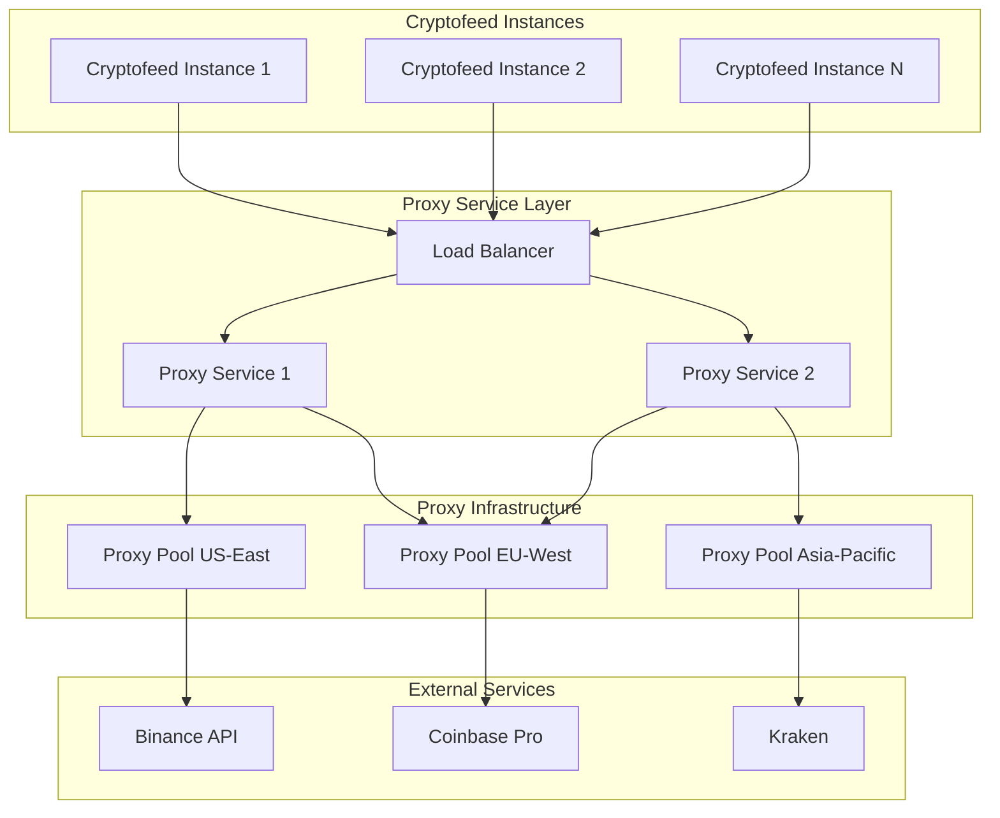
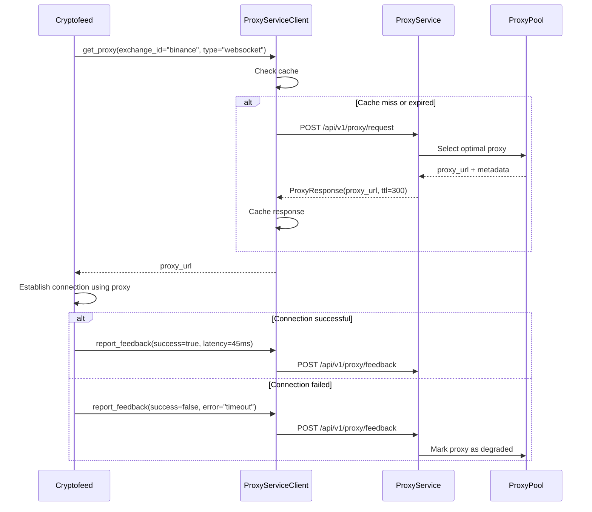

# External Proxy Service Delegation - Technical Design

## System Architecture Overview

The external proxy service delegation architecture transforms cryptofeed from embedded proxy management to a service-oriented approach where specialized proxy services handle inventory, health monitoring, load balancing, and rotation.



## Component Design

### 1. Proxy Service Client (Cryptofeed Side)

#### ProxyServiceClient Class
```python
class ProxyServiceClient:
    """Client for communicating with external proxy services."""
    
    def __init__(self, service_endpoints: List[str], fallback_config: ProxySettings):
        self.endpoints = service_endpoints
        self.fallback_config = fallback_config
        self.circuit_breaker = CircuitBreaker()
        self.cache = ProxyResponseCache()
        self.http_client = aiohttp.ClientSession()
    
    async def get_proxy(self, request: ProxyRequest) -> Optional[ProxyResponse]:
        """Request proxy from external service with fallback."""
        
    async def report_feedback(self, feedback: ProxyFeedback) -> None:
        """Report proxy usage feedback to service."""
        
    def _get_fallback_proxy(self, exchange_id: str, connection_type: str) -> Optional[str]:
        """Get proxy from embedded fallback configuration."""
```

#### Request/Response Models
```python
class ProxyRequest(BaseModel):
    """Proxy request to external service."""
    exchange_id: str
    connection_type: Literal['http', 'websocket']
    region: Optional[str] = None
    client_id: str
    metadata: Dict[str, Any] = Field(default_factory=dict)

class ProxyResponse(BaseModel):
    """Proxy response from external service."""
    proxy_url: str
    strategy: str
    ttl_seconds: int
    fallback_policy: Literal['direct_connection', 'embedded_fallback', 'fail']
    metadata: Dict[str, Any] = Field(default_factory=dict)

class ProxyFeedback(BaseModel):
    """Feedback about proxy usage."""
    proxy_url: str
    exchange_id: str
    connection_type: str
    success: bool
    latency_ms: Optional[int] = None
    error_details: Optional[str] = None
    timestamp: datetime
    client_id: str
```

### 2. Enhanced ProxyInjector Integration

#### Updated ProxyInjector Class
```python
class ProxyInjector:
    """Enhanced proxy injector with external service delegation."""
    
    def __init__(self, proxy_settings: ProxySettings, service_client: Optional[ProxyServiceClient] = None):
        self.settings = proxy_settings
        self.service_client = service_client
        self.embedded_mode = service_client is None
    
    async def get_http_proxy_url(self, exchange_id: str) -> Optional[str]:
        """Get HTTP proxy URL with service delegation."""
        if self.service_client and not self.embedded_mode:
            return await self._get_proxy_from_service(exchange_id, 'http')
        return self._get_proxy_from_embedded(exchange_id, 'http')
    
    async def create_websocket_connection(self, url: str, exchange_id: str, **kwargs):
        """Create WebSocket connection with delegated proxy."""
        proxy_url = await self._get_proxy_from_service(exchange_id, 'websocket')
        if proxy_url:
            kwargs['proxy'] = proxy_url
            # Report connection attempt
            asyncio.create_task(self._report_connection_start(proxy_url, exchange_id))
        
        try:
            connection = await websockets.connect(url, **kwargs)
            if proxy_url:
                asyncio.create_task(self._report_connection_success(proxy_url, exchange_id))
            return connection
        except Exception as e:
            if proxy_url:
                asyncio.create_task(self._report_connection_failure(proxy_url, exchange_id, str(e)))
            raise
```

### 3. Circuit Breaker Pattern

#### CircuitBreaker Implementation
```python
class CircuitBreaker:
    """Circuit breaker for proxy service reliability."""
    
    def __init__(self, failure_threshold: int = 5, recovery_timeout: int = 30):
        self.failure_threshold = failure_threshold
        self.recovery_timeout = recovery_timeout
        self.failure_count = 0
        self.last_failure_time = None
        self.state = CircuitBreakerState.CLOSED  # CLOSED, OPEN, HALF_OPEN
    
    async def call(self, func: Callable, *args, **kwargs):
        """Execute function with circuit breaker protection."""
        if self.state == CircuitBreakerState.OPEN:
            if self._should_attempt_reset():
                self.state = CircuitBreakerState.HALF_OPEN
            else:
                raise CircuitBreakerOpenError("Proxy service circuit breaker is open")
        
        try:
            result = await func(*args, **kwargs)
            self._on_success()
            return result
        except Exception as e:
            self._on_failure()
            raise
```

### 4. Proxy Response Caching

#### ProxyResponseCache Implementation
```python
class ProxyResponseCache:
    """Cache for proxy service responses."""
    
    def __init__(self, default_ttl: int = 300):
        self.cache: Dict[str, CacheEntry] = {}
        self.default_ttl = default_ttl
    
    def get(self, cache_key: str) -> Optional[ProxyResponse]:
        """Get cached proxy response if not expired."""
        entry = self.cache.get(cache_key)
        if entry and not entry.is_expired():
            return entry.response
        return None
    
    def put(self, cache_key: str, response: ProxyResponse) -> None:
        """Cache proxy response with TTL."""
        ttl = response.ttl_seconds or self.default_ttl
        expiry = datetime.utcnow() + timedelta(seconds=ttl)
        self.cache[cache_key] = CacheEntry(response, expiry)
    
    def _generate_cache_key(self, request: ProxyRequest) -> str:
        """Generate cache key for proxy request."""
        return f"{request.exchange_id}:{request.connection_type}:{request.region}"
```

## Communication Protocol Specification

### 1. Service Discovery
```python
class ProxyServiceDiscovery:
    """Discover and manage proxy service endpoints."""
    
    async def discover_endpoints(self) -> List[str]:
        """Discover available proxy service endpoints."""
        # Implementation options:
        # 1. Static configuration via environment variables
        # 2. DNS SRV record lookup
        # 3. Consul/etcd service discovery
        # 4. Kubernetes service discovery
        pass
    
    async def health_check_endpoint(self, endpoint: str) -> bool:
        """Check if proxy service endpoint is healthy."""
        pass
```

### 2. API Authentication
```python
class ProxyServiceAuth:
    """Handle authentication with proxy services."""
    
    def __init__(self, auth_method: str, credentials: Dict[str, str]):
        self.auth_method = auth_method  # "bearer_token", "mutual_tls", "api_key"
        self.credentials = credentials
    
    def get_auth_headers(self) -> Dict[str, str]:
        """Get authentication headers for requests."""
        if self.auth_method == "bearer_token":
            return {"Authorization": f"Bearer {self.credentials['token']}"}
        elif self.auth_method == "api_key":
            return {"X-API-Key": self.credentials['api_key']}
        return {}
```

### 3. Request/Response Flow



## Configuration Integration

### Enhanced ProxySettings
```python
class ExternalProxyServiceConfig(BaseModel):
    """Configuration for external proxy service integration."""
    enabled: bool = Field(default=False, description="Enable external proxy service")
    endpoints: List[str] = Field(default_factory=list, description="Proxy service endpoints")
    auth_method: str = Field(default="bearer_token", description="Authentication method")
    auth_credentials: Dict[str, str] = Field(default_factory=dict, description="Auth credentials")
    timeout_seconds: int = Field(default=10, description="Request timeout")
    cache_ttl_seconds: int = Field(default=300, description="Default cache TTL")
    circuit_breaker_enabled: bool = Field(default=True, description="Enable circuit breaker")
    fallback_to_embedded: bool = Field(default=True, description="Fall back to embedded config")

class ProxySettings(BaseSettings):
    """Enhanced proxy settings with external service support."""
    # Existing fields...
    enabled: bool = Field(default=False)
    default: Optional[ConnectionProxies] = None
    exchanges: Dict[str, ConnectionProxies] = Field(default_factory=dict)
    
    # New external service configuration
    external_service: ExternalProxyServiceConfig = Field(default_factory=ExternalProxyServiceConfig)
```

### Environment Variable Configuration
```bash
# External proxy service configuration
CRYPTOFEED_PROXY_EXTERNAL_SERVICE__ENABLED=true
CRYPTOFEED_PROXY_EXTERNAL_SERVICE__ENDPOINTS=["https://proxy-service-1:8080", "https://proxy-service-2:8080"]
CRYPTOFEED_PROXY_EXTERNAL_SERVICE__AUTH_METHOD=bearer_token
CRYPTOFEED_PROXY_EXTERNAL_SERVICE__AUTH_CREDENTIALS__TOKEN=your-service-token
CRYPTOFEED_PROXY_EXTERNAL_SERVICE__TIMEOUT_SECONDS=10
CRYPTOFEED_PROXY_EXTERNAL_SERVICE__FALLBACK_TO_EMBEDDED=true

# Embedded fallback configuration (preserved)
CRYPTOFEED_PROXY_ENABLED=true
CRYPTOFEED_PROXY_DEFAULT__HTTP__URL=socks5://fallback-proxy:1080
```

## Error Handling and Resilience

### 1. Service Unavailability Scenarios
```python
class ProxyServiceUnavailableError(Exception):
    """Raised when proxy service is unavailable."""
    pass

class ProxyServiceTimeoutError(Exception):
    """Raised when proxy service request times out."""
    pass

async def _handle_service_error(self, error: Exception, request: ProxyRequest) -> Optional[str]:
    """Handle proxy service errors with fallback strategy."""
    if isinstance(error, (ProxyServiceUnavailableError, ProxyServiceTimeoutError)):
        LOG.warning(f"Proxy service unavailable, falling back to embedded config: {error}")
        return self._get_fallback_proxy(request.exchange_id, request.connection_type)
    
    # For other errors, still attempt fallback
    LOG.error(f"Proxy service error, falling back: {error}")
    return self._get_fallback_proxy(request.exchange_id, request.connection_type)
```

### 2. Graceful Degradation Strategy
1. **Primary**: External proxy service provides optimal proxy selection
2. **Secondary**: Cached proxy responses for recent requests
3. **Tertiary**: Embedded proxy configuration (static/simple pools)
4. **Fallback**: Direct connection without proxy

## Performance Considerations

### 1. Async Operations
- All proxy service calls are non-blocking async operations
- Feedback reporting does not block connection establishment
- Concurrent requests to multiple service endpoints for redundancy

### 2. Caching Strategy
- Cache successful proxy responses based on TTL
- Implement cache warming for frequently used exchange/connection combinations
- LRU eviction for cache size management

### 3. Connection Pooling
- Reuse HTTP connections to proxy service endpoints
- Implement connection limits and timeouts
- Use HTTP/2 for improved multiplexing if supported

## Monitoring and Observability

### 1. Metrics Collection
```python
@dataclass
class ProxyServiceMetrics:
    """Metrics for proxy service interactions."""
    requests_total: int = 0
    requests_success: int = 0
    requests_failed: int = 0
    requests_cached: int = 0
    avg_response_time_ms: float = 0.0
    circuit_breaker_open_count: int = 0
    fallback_used_count: int = 0
```

### 2. Logging Strategy
- Structured logging with correlation IDs for request tracing
- Log proxy service requests/responses with sanitized URLs
- Log fallback usage and circuit breaker state changes
- Performance metrics logged at INFO level

## Migration and Deployment Strategy

### Phase 1: Parallel Implementation
- Add external proxy service client alongside existing proxy system
- Feature flag to enable/disable external service delegation
- Comprehensive testing with both systems running in parallel

### Phase 2: Gradual Rollout
- Enable external service for non-critical exchanges first
- Monitor performance and reliability metrics
- Gradual expansion to all exchanges based on service stability

### Phase 3: Full Delegation
- Primary path through external service with embedded fallback
- Embedded proxy system maintained for reliability
- Optional complete removal of embedded pools in future versions

## Security Considerations

### 1. Communication Security
- All proxy service communication over HTTPS with certificate validation
- API authentication via Bearer tokens or mutual TLS
- Proxy credentials encrypted in transit and never logged in clear text

### 2. Credential Management
- Proxy credentials managed by external service, not stored in cryptofeed
- Service provides complete proxy URLs with embedded authentication
- Credential rotation handled transparently by proxy service

### 3. Network Security
- Proxy service endpoints behind VPC/private networks when possible
- IP allowlisting for proxy service access
- Regular security audits of proxy service communication