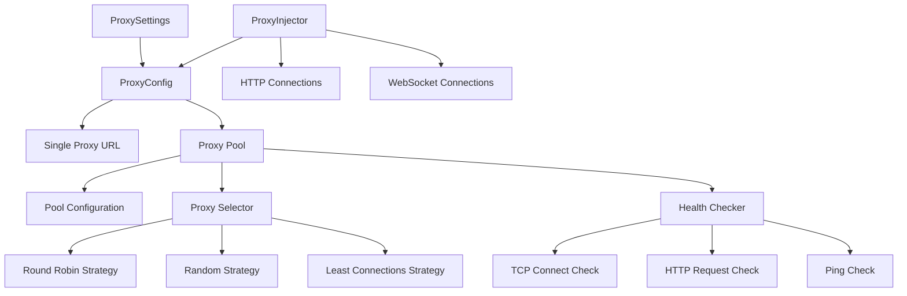
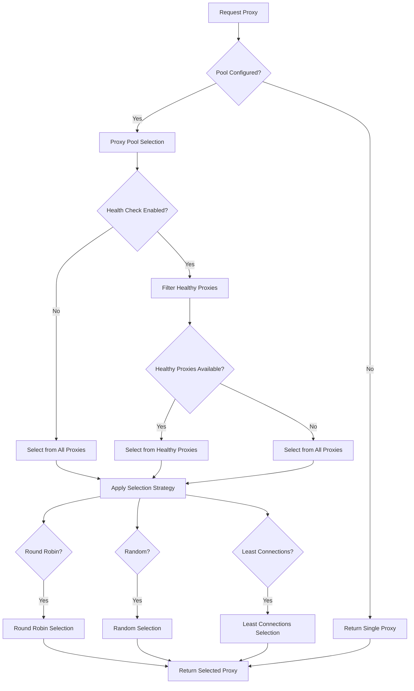
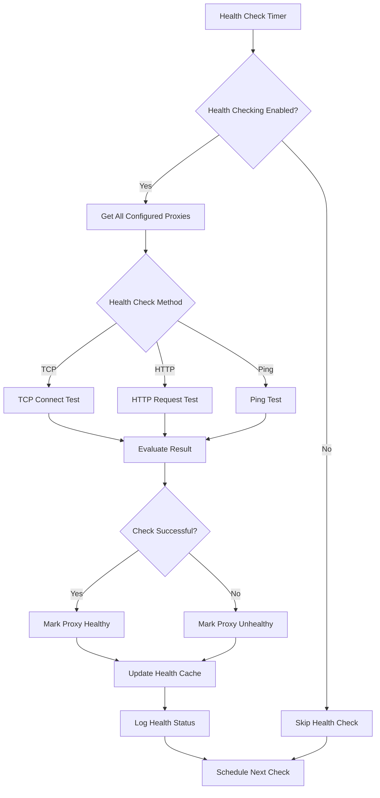

# Technical Design Document

## Overview

**Purpose**: This feature delivers proxy pool capabilities that extend the existing cryptofeed proxy system with multiple proxy support, load balancing, health checking, and automatic failover for production high-availability deployments.

**Users**: Production operations teams, high-frequency trading platforms, and enterprise deployments will utilize this for proxy redundancy and automatic failover in critical trading infrastructure.

**Impact**: Enhances the current single-proxy system by adding pool management capabilities while maintaining full backward compatibility with existing configurations.

### Goals
- Extend existing proxy system with multiple proxy support per exchange
- Provide automatic failover and load balancing across proxy pools
- Add configurable health checking with multiple strategies
- Maintain zero breaking changes to existing proxy configurations
- Support production-grade operational requirements

### Non-Goals
- Replace existing single-proxy functionality (maintain backward compatibility)
- Complex enterprise proxy management features (keep focused on pools)
- Real-time proxy provisioning or dynamic discovery (static configuration only)
- Cross-region proxy orchestration (single deployment scope)

## Architecture

### Existing Proxy System Integration

**Current Architecture Preserved**:
- ProxySettings, ProxyConfig, ProxyInjector classes remain unchanged
- Existing configuration patterns (environment variables, YAML) maintained
- Current HTTP/WebSocket transport integration preserved
- All existing tests continue to pass without modification

**Extension Strategy**:
- Extend ProxyConfig to support pool configurations alongside single proxy
- Add ProxyPool and ProxySelector classes as new components
- Integrate pool selection into existing ProxyInjector without breaking changes
- Add health checking as optional background service

### Enhanced Architecture



## Key Design Decisions

### Decision 1: Extension vs Replacement Strategy
- **Context**: Need to add pool functionality without breaking existing deployments
- **Alternatives**: Replace proxy system entirely, create separate pool system, extend existing system
- **Selected Approach**: Extend existing ProxyConfig with optional pool configuration
- **Rationale**: Maintains backward compatibility while providing clear upgrade path
- **Trade-offs**: Slightly more complex configuration schema vs zero migration effort

### Decision 2: Selection Strategy Architecture
- **Context**: Need pluggable load balancing strategies for different deployment needs
- **Alternatives**: Hard-coded round-robin, strategy enum, pluggable strategy interface
- **Selected Approach**: Strategy pattern with built-in strategies and extensible interface
- **Rationale**: Balances flexibility with simplicity, common strategies built-in
- **Trade-offs**: More complex than single strategy vs flexibility for future needs

### Decision 3: Health Checking Implementation
- **Context**: Need reliable proxy health detection with minimal performance impact
- **Alternatives**: No health checking, synchronous health checks, background health checks
- **Selected Approach**: Background async health checking with cached results
- **Rationale**: Provides health information without impacting connection performance
- **Trade-offs**: Additional background processing vs reliable failover capability

## System Flows

### Proxy Selection Flow


### Health Checking Flow


## Components and Interfaces

### ProxyPool Extension

#### Responsibility & Boundaries
- **Primary Responsibility**: Manage multiple proxy configurations with selection strategies and health checking
- **Domain Boundary**: Extension of existing proxy configuration domain
- **Data Ownership**: Proxy pool configuration, health state, selection state
- **Transaction Boundary**: Individual proxy selection operations and health check cycles

#### Dependencies
- **Inbound**: ProxySettings via extended ProxyConfig
- **Outbound**: ProxySelector for selection logic, HealthChecker for health management
- **External**: Network connectivity for health checking

#### Contract Definition

**Service Interface**:
```typescript
interface ProxyPool {
  selectProxy(): Result<ProxyConfig, PoolError>;
  getAllProxies(): ProxyConfig[];
  getHealthyProxies(): ProxyConfig[];
  getProxyHealth(proxy: ProxyConfig): HealthStatus;
  updateHealth(proxy: ProxyConfig, status: HealthStatus): void;
}
```

- **Preconditions**: Valid proxy pool configuration, initialized selection strategy
- **Postconditions**: Selected proxy is available for connection, health state updated
- **Invariants**: At least one proxy always available (fallback to unhealthy if needed)

### ProxySelector Strategy

#### Responsibility & Boundaries
- **Primary Responsibility**: Implement proxy selection algorithms for load balancing
- **Domain Boundary**: Proxy selection and load balancing logic
- **Data Ownership**: Selection state (current index, connection counts, etc.)

#### Contract Definition

**Strategy Interface**:
```typescript
interface ProxySelector {
  select(proxies: ProxyConfig[]): ProxyConfig;
  recordConnection(proxy: ProxyConfig): void;
  recordDisconnection(proxy: ProxyConfig): void;
}

interface RoundRobinSelector extends ProxySelector {
  currentIndex: number;
}

interface LeastConnectionsSelector extends ProxySelector {
  connectionCounts: Map<ProxyConfig, number>;
}
```

### HealthChecker Service

#### Responsibility & Boundaries
- **Primary Responsibility**: Monitor proxy health status through configurable check methods
- **Domain Boundary**: Proxy health monitoring and status management
- **Data Ownership**: Health check results, check schedules, health state cache

#### Contract Definition

**Service Interface**:
```typescript
interface HealthChecker {
  start(): Promise<void>;
  stop(): Promise<void>;
  checkProxy(proxy: ProxyConfig): Promise<HealthCheckResult>;
  getHealthStatus(proxy: ProxyConfig): HealthStatus;
  setHealthCheckMethod(method: HealthCheckMethod): void;
}

interface HealthCheckResult {
  proxy: ProxyConfig;
  healthy: boolean;
  latency?: number;
  error?: string;
  timestamp: Date;
}
```

## Data Models

### Enhanced Configuration Model

**Extended ProxyConfig**:
```typescript
class ProxyConfig {
  // Existing single proxy configuration
  url?: string;
  timeout_seconds?: number;
  
  // New pool configuration
  pool?: ProxyPoolConfig;
}

class ProxyPoolConfig {
  proxies: ProxyUrlConfig[];
  strategy: SelectionStrategy;
  health_check: HealthCheckConfig;
}

class ProxyUrlConfig {
  url: string;
  weight?: number;
  enabled?: boolean;
  metadata?: Record<string, any>;
}

class HealthCheckConfig {
  enabled: boolean;
  method: HealthCheckMethod;
  interval_seconds: number;
  timeout_seconds: number;
  retry_count: number;
  http_config?: HTTPHealthCheckConfig;
}
```

### State Management Model

**Health State Tracking**:
```typescript
class ProxyHealthState {
  proxy: ProxyConfig;
  healthy: boolean;
  lastChecked: Date;
  consecutiveFailures: number;
  totalChecks: number;
  averageLatency: number;
}

class PoolSelectionState {
  strategy: SelectionStrategy;
  roundRobinIndex: number;
  connectionCounts: Map<string, number>;
  lastSelected: Date;
}
```

## Error Handling

### Error Strategy
Robust error handling with graceful degradation and comprehensive fallback mechanisms for high-availability requirements.

### Error Categories and Responses

**Pool Configuration Errors** (422): Invalid pool configuration → validate configuration and provide detailed error messages; Missing proxy URLs → fallback to single proxy configuration; Invalid selection strategy → default to round-robin

**Health Check Errors** (500): Health check service failure → disable health filtering temporarily; Network connectivity issues → increase check intervals; All proxies unhealthy → allow unhealthy proxy selection with warnings

**Selection Errors** (503): No healthy proxies available → select from all proxies with warning; Selection strategy failure → fallback to random selection; Pool exhausted → fallback to single proxy configuration

### Monitoring and Observability
- Health check status logging with proxy identification and error details
- Selection strategy performance metrics (latency, success rate)
- Pool utilization monitoring (proxy usage distribution, health statistics)
- Error rate tracking for operational alerting

## Testing Strategy

### Unit Tests
- ProxyPool configuration validation and proxy selection logic
- Selection strategy implementations (round-robin, random, least-connections)
- Health checker methods (TCP, HTTP, ping) with mock network conditions
- Configuration parsing and validation for pool settings
- Error handling and fallback scenarios

### Integration Tests
- End-to-end proxy selection with real proxy servers
- Health checking integration with actual network connectivity
- Backward compatibility testing with existing single-proxy configurations
- Performance testing under concurrent load with multiple proxies
- Failover testing with simulated proxy failures

### Performance Tests
- Proxy selection latency under high-frequency selection scenarios
- Health checking overhead measurement with various check intervals
- Memory usage with large proxy pools (100+ proxies)
- Concurrent connection handling with pool selection

## Security Considerations

**Proxy Pool Security**:
- Health check credentials isolation and secure storage
- Proxy URL validation to prevent configuration injection attacks
- Network security for health check traffic routing
- Access control for pool configuration and health status information

**Operational Security**:
- Health check traffic encryption and authentication
- Proxy failure alerting without exposing sensitive configuration
- Audit logging for pool configuration changes
- Secure defaults for health check intervals and timeouts

## Performance & Scalability

**Target Metrics**:
- Proxy selection latency: <1ms for cached healthy proxies
- Pool size support: 100+ proxies without performance degradation
- Health check frequency: Configurable 10-300 second intervals
- Failover time: <1 second from failure detection to selection update

**Optimization Strategies**:
- Cached health status to avoid blocking proxy selection
- Asynchronous health checking with background worker threads
- Connection pooling for health check requests
- Configurable health check batching for large pools

**Scaling Considerations**:
- Health checking parallelization for large proxy pools
- Memory-efficient health state storage with TTL cleanup
- Health check interval adaptation based on proxy stability
- Connection count tracking optimization for least-connections strategy